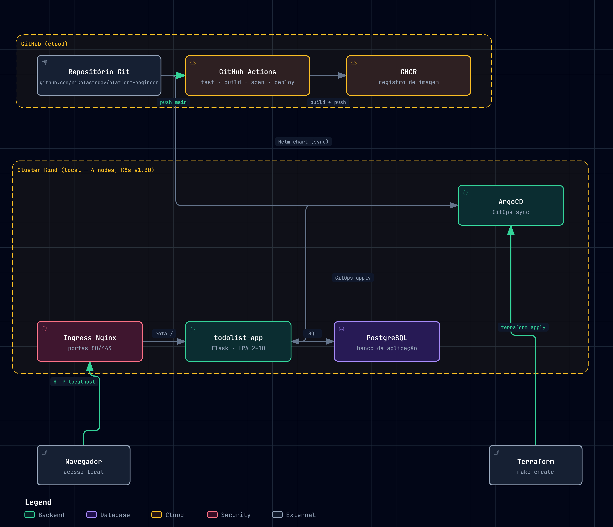

# Platform Engineer — Todolist

Plataforma Kubernetes local com deploy automatizado via **GitOps** (ArgoCD), provisionada por código (Terraform + Kind). Aplicação Flask + PostgreSQL com CI/CD, autoscaling e acesso externo.

## Índice

- [Visão geral](#visão-geral)
- [Arquitetura](#arquitetura)
- [Requisitos atendidos](#requisitos-atendidos)
- [Pré-requisitos](#pré-requisitos)
- [Execução](#execução)
- [Estrutura do repositório](#estrutura-do-repositório)
- [Pipeline CI/CD](#pipeline-cicd)
- [Acesso à aplicação](#acesso-à-aplicação)
- [Escalabilidade e resiliência](#escalabilidade-e-resiliência)
- [Registro de decisões](#registro-de-decisões)
- [Evidências de execução](#evidências-de-execução)

---

## Visão geral

- **Cluster:** Kind (4 nodes, Kubernetes v1.30.0), provisionado com Terraform via `make create`
- **Deploy:** ArgoCD sincroniza a aplicação a partir do Helm chart no repositório (GitOps)
- **Aplicação:** Flask + PostgreSQL, acessível em `http://localhost/`
- **Escalabilidade:** HPA, PodDisruptionBudget e healthchecks no chart

```bash
make create    # sobe todo o ambiente (~3–5 min)
make destroy   # remove tudo
```

---

## Arquitetura

[](https://nikolastsdev.github.io/platform-engineer/arquitetura.html)

Cluster Kind local provisionado com **Terraform** e deploy **GitOps** via ArgoCD a partir de `k8s/helm/todolist-app`, com acesso externo via Ingress NGINX em `http://localhost/`. Veja a versão interativa em [nikolastsdev.github.io/platform-engineer/arquitetura.html](https://nikolastsdev.github.io/platform-engineer/arquitetura.html).

### Divisão de responsabilidades

| Etapa | Ferramenta | Onde roda |
|-------|-----------|-----------|
| Provisionamento (cluster + deps) | Terraform + Kind + Helm | CLI local (`make create`) |
| Build da imagem | Docker / build-push-action | GitHub Actions (`.github/workflows/ci.yaml`) |
| Deploy da aplicação | ArgoCD (GitOps sync) | ArgoCD + Helm chart no repo (mono-repo) |

### Por que Kind local (em vez de cloud)?

O ambiente é local com **Kind** por limitações de billing em cloud. O fluxo é idêntico a um cluster real: Terraform provisiona os recursos, ArgoCD aplica via GitOps e o ingress expõe a aplicação externamente. Detalhes e argumentos completos no [registro de decisões](docs/decisoes/escopo-decisoes.md#ambiente-kind-local-em-vez-de-cloud-eksgke).

---

## Requisitos atendidos

| Req | Descrição | Como é atendido |
|-----|-----------|-----------------|
| **R1** | Cluster e dependências provisionados por código, repetível | `terraform/` + `make create` (Kind, ingress-nginx, metrics-server, ArgoCD) |
| **R2** | Deploy automático de nova versão da app | ArgoCD sincroniza `k8s/helm/todolist-app` a partir do repositório |
| **R3** | Acesso pelo navegador, fora do cluster | Ingress nginx expõe a app em `http://localhost/` |
| **R4** | Escalável e resiliente | HPA, PodDisruptionBudget e probes no chart (`hpa.yaml`, `pdb.yaml`, `deployment.yaml`) |
| **R5** | Documentação, decisões e evidências de execução | Este README + `docs/decisoes/` + `docs/evidencias/` |

---

## Pré-requisitos

- Linux (testado em Ubuntu)
- [Docker](https://docs.docker.com/get-docker/)
- [kind](https://kind.sigs.k8s.io/docs/user/quick-start/#installation)
- [kubectl](https://kubernetes.io/docs/tasks/tools/)
- [Terraform](https://developer.hashicorp.com/terraform/downloads) (>= 1.x)
- [Helm](https://helm.sh/docs/intro/install/) (>= 3.x)
- [gh](https://cli.github.com/) CLI autenticado (para o CI/build GHCR)

---

## Execução

```bash
make create    # sobe todo o ambiente (3-5 min)
make destroy   # remove todo o ambiente
```

Acesso pela máquina local:

- Aplicação: `http://localhost/`
- ArgoCD: `https://localhost:8080` (NodePort 30080 → porta 8080 do host)

O `make create` executa `terraform init + apply` e provisiona cluster, ingress-nginx, metrics-server, ArgoCD e namespaces. Tudo por código.

---

## Estrutura do repositório

```
├── terraform/                     # IaC (kind, ingress, metrics, argocd)
│   ├── main.tf                    # cluster kind + kubeconfig
│   ├── argocd.tf                  # repo credentials (PAT via gh auth token)
│   ├── variables.tf / providers.tf / outputs.tf
├── .github/workflows/
│   ├── ci.yaml                    # Test → Build+Push GHCR → Deploy GitOps
│   └── pages.yaml                 # Publica o diagrama de arquitetura no GitHub Pages
├── k8s/
│   └── helm/todolist-app/         # Helm chart (ArgoCD sync)
│       ├── Chart.yaml, values.yaml, values.schema.json
│       └── templates/             # namespace, deployment, service, ingress, hpa, pdb, ...
├── app/todolist/                  # Aplicação Flask (Dockerfile, app.py, requirements.txt)
├── docs/
│   ├── arquitetura/               # Diagrama da arquitetura (arquitetura.html + .json + imagem PNG)
│   ├── decisoes/
│   │   └── escopo-decisoes.md     # Registro de decisões (argumentos, o que descartou)
│   ├── apresentacao/
│   │   └── roteiro-apresentacao.md  # Roteiro para apresentar o projeto (glossário + Q&A)
│   └── evidencias/                # Evidências reais de execução
├── scripts/promote-image.py      # CI: promove a tag da imagem no values.yaml
├── Makefile                       # create / destroy / clean
└── README.md                      # Este arquivo
```

---

## Pipeline CI/CD

Pipeline em 3 etapas (`.github/workflows/ci.yaml`) — só um ambiente local:

```
test  →  build  →  deploy
```

- **test:** testes da aplicação (Python + PostgreSQL)
- **build:** build + push da imagem para GHCR (`ghcr.io/nikolastsdev/platform-engineer/todolist:latest`)
- **deploy:** promove a tag (SHA) da imagem no `values.yaml` do chart (via `scripts/promote-image.py`); o ArgoCD detecta a mudança no repositório e aplica ao cluster

---

## Acesso à aplicação

- Aplicação: `http://localhost/` (redirect para `/login`)
- ArgoCD: `https://localhost:8080` (NodePort 30080, exposto na porta 8080 do host)
- Senha inicial do ArgoCD:

```bash
kubectl -n argocd get secret argocd-initial-admin-secret \
  -o jsonpath='{.data.password}' | base64 -d
```

Portas expostas pelo Kind no host: 80 / 443 (ingress) e 8080 (ArgoCD).

---

## Escalabilidade e resiliência

- **HPA (HorizontalPodAutoscaler):** escala o número de réplicas com base na utilização de CPU/memória (`hpa.yaml`)
- **PDB (PodDisruptionBudget):** garante disponibilidade mínima durante manutenções/drenagens (`pdb.yaml`)
- **Réplicas parametrizáveis:** configuração via `values.yaml` (`replicaCount`)
- **Healthchecks:** liveness, readiness e startup probes apontam para `/healthz` da app, que valida a conexão com o PostgreSQL (`SELECT 1`) — `deployment.yaml` + `app.py`
- **PostgreSQL:** deployado como deployment + service + secret no mesmo chart (`postgresql.yaml`)

---

## Registro de decisões

Ver [docs/decisoes/escopo-decisoes.md](docs/decisoes/escopo-decisoes.md) — registro das escolhas técnicas, desafios encontrados e o que foi descartado.

**Ferramentas de apoio:** este projeto foi desenvolvido com DeepSeek Harness (DSH) como ambiente de agente e Omniroute ([github.com/diegosouzapw/OmniRoute](https://github.com/diegosouzapw/OmniRoute)) como gateway de IA. Detalhes em [docs/decisoes](docs/decisoes/escopo-decisoes.md#ferramentas-de-apoio-ao-desenvolvimento-e-por-que).

---

## Evidências de execução

Artefatos reais gerados na execução (ver `docs/evidencias/`):

| Evidência | Arquivo | O que prova |
|-----------|---------|-------------|
| Log completo do provisionamento (`make create`) | `docs/evidencias/log-make-create.txt` | R1/R2 — cluster + ingress + ArgoCD provisionados por código, sem passos manuais |
| Resumo kubectl (nodes, pods, app, ingress) | `docs/evidencias/resumo-kubectl.txt` | R1/R4 — 4 nodes Ready, ArgoCD Synced/Healthy, app 2/2 Running |
| Acesso externo via curl (R3) | `docs/evidencias/curl-acesso.txt` | App HTTP 302→200 em `http://localhost`, ArgoCD HTTP 200 |
| Página de login da app renderizada | `docs/evidencias/app-login.html` | O que o navegador renderiza (R3) |
