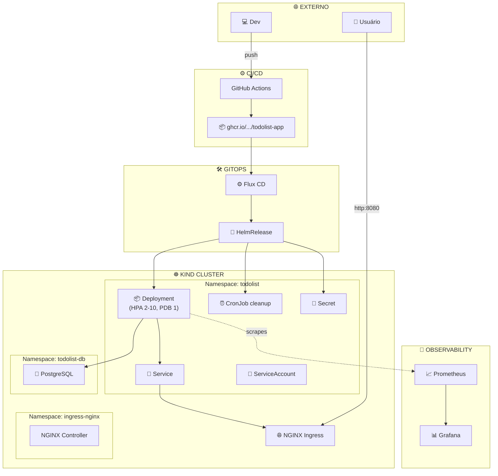

# 🏗️ Arquitetura do Projeto — todolist-app Platform

Diagramas Mermaid (renderiza no GitHub automaticamente) + Draw.io editável.

## 📑 Índice

- [Estado Atual (as-is)](./arquitetura-as-is.md) — `docs/diagrams/arquitetura-as-is.md`
- [Estado Ideal (to-be)](./arquitetura-to-be.md) — `docs/diagrams/arquitetura-to-be.md`
- [Modelo C4 (Context, Container, Component)](./modelo-c4.md) — `docs/diagrams/modelo-c4.md`
- [Draw.io editável](./arquitetura.drawio) — abrir em https://app.diagrams.net

## 🎯 Diagrama principal — Visão geral to-be

## 🛡️ Decisões arquiteturais

- [ADR-0001: Cluster local (Kind)](../adr/0001-cluster-local-kind.md)
- [ADR-0002: Terraform como IaC](../adr/0002-terraform-iac.md)
- [ADR-0003: Helm como package manager](../adr/0003-helm-package-manager.md)
- [ADR-0004: GitOps com Flux CD](../adr/0004-gitops-flux-cd.md)
- [ADR-0005: NGINX como Ingress](../adr/0005-nginx-ingress.md)
- [ADR-0006: HPA + PDB para resiliência](../adr/0006-hpa-pdb-resiliencia.md)
- [ADR-0007: GHCR para imagens](../adr/0007-ghcr-imagens.md)
- [ADR-0008: Trivy para vulnerability scanning](../adr/0008-trivy-scan.md)

## 🧭 Navegação rápida

- [README principal](../../README.md)
- [Decisões gerais](../DECISOES.md)
- [ADRs formais](../adr/)
