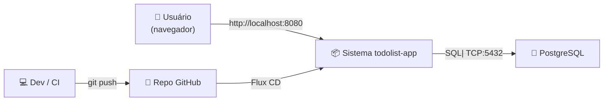
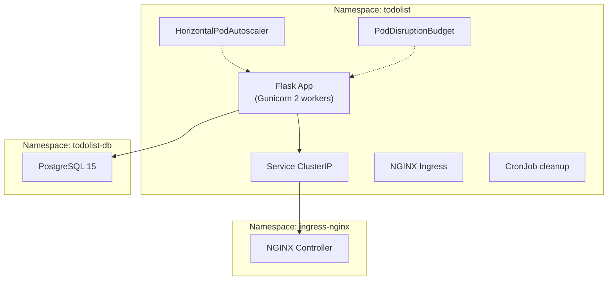
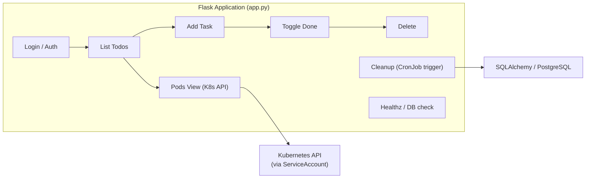

# Modelo C4 — todolist-app

Referência: [C4-PlantUML / C4 Model](https://c4model.info/)

## C1 — Context (Sistema como caixa preta)

## C2 — Container (Componentes internos, 1 nível de detalhe)

## C3 — Component (Dentro do App — código)

## Legenda

- **C1:** Quem usa o sistema (usuário, dev) e o que ele faz
- **C2:** Os containers/namespaces que compõem a solução (deploy, db, ingress)
- **C3:** Componentes internos da aplicação (módulos Flask)
